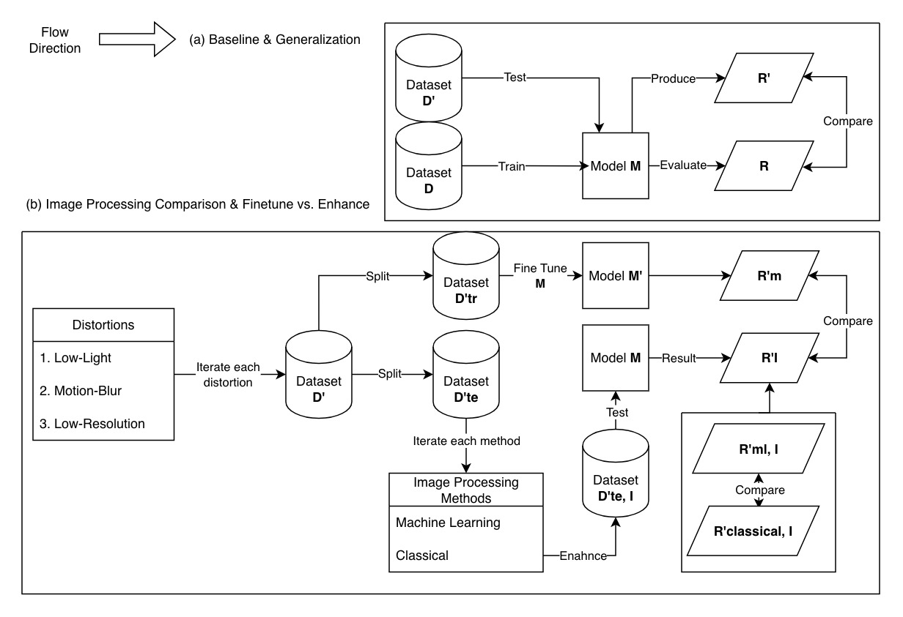

# ECE253 - Phone Detection: Effect of Image Processing

## 0. Framework

## 1. Dataset
### **Dataset D** can be found on RoboFlow: 
[Clean Data](https://universe.roboflow.com/cell-phone-v3g3u/cell-phone-z59qs/dataset/1)

### **Dataset D'** is on:
[Self-Collected Data](https://drive.google.com/drive/folders/14v7EyqaY3exsCvuAU_TFCJRZCdkb4RLV?usp=drive_link)

Note: *Please modify the code according to the local path where you download the data.*

## 2. Add Distortions Manually
In the `ECE_253_project/add_distortion`, it contains several files:
 - `reduce_light.ipynb` - adds **Low-Light Distortion** to images
 - `motion_blur.ipynb` - adds **Motion_Blur Distortion** to images
 - `compress.py` - adds **Low-Resolution Distortion** to images

## 3. Image Processing (Enhancement)
### Traditional Methods
located in `ECE_253_project/enhance_traditional`
- See instruction: `ECE_253_project/enhance_traditional/README.md`

### Machine Learning Methods
located in `ECE_253_project/enhance_ml`
- See instruction: `ECE_253_project/enhance_ml/README.md`

## 4. Object Detection Models (YOLOv8 / YOLOv11)

graph_result.ipynb is for graphing all the test results and the loss curve of the fine tuning models

compress.py makes the raw images we collected compressed
